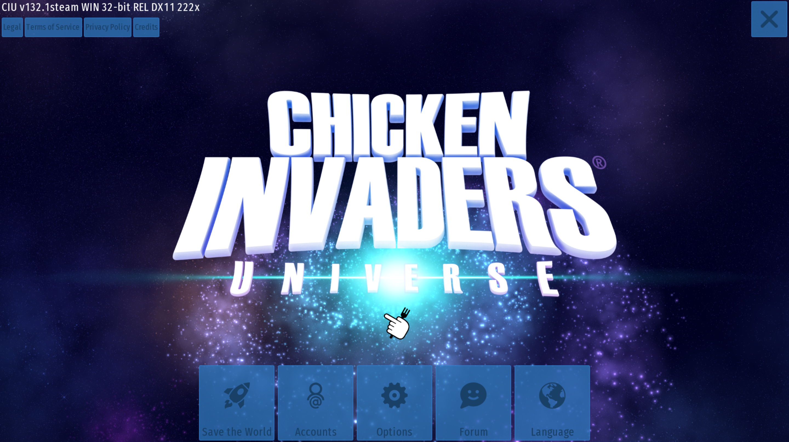

### Introduction
This is my game project for INT2215 Advanced Programming course at UET. This game is a simple 2D game, which is a clone of the famous game `Chicken Invaders Universe`. The game is written in C++ programming language with SDL2 library. I wrote this entire game on Linux(Ubuntu 22.04 LTS, Linux 5.19.0-40-generic x86_64) with Visual Studio Code IDE. This project is configed for GNU/Linux, with the windows OS or Mac OS, please reconfig the makefile correctly.

### About this game 
Players have 10 lives to complete all three levels, and the game ends when the player either wins or loses. To control the spaceship, the player must use their ```mouse``` to move the ship and ```LEFT CLICK``` to fire the bullet. There are three types of bullets to choose from, adding an extra layer of strategy to the game.Press  ```SPACE``` to pause the game. Press ```ESC``` to quit the game. If you lose during the game, you can press ```C``` to continue the game.Every 5 secs there will be a present from the sky to support you. The present will be random.Each level will have another theme music.


In  Level 1, the player will encounter chickens shooting eggs towards them, which they must avoid while shooting down the chickens to survive. Level 2 features an asteroid rain, where players must navigate through a shower of asteroids while simultaneously shooting them down (You have to shot multiple times in order to the asteroid to dissapear, each time you shoot the asteroid keeps getting smaller and smaller). 
Finally, Level 3 presents a challenging boss, which shoots eggs in a circular motion and chases after the player.

### Installation and Play
#### Step 1 : Install SDL2 library

#### For Debian/Ubuntu
```sudo apt install libsdl2-dev libsdl2-image-dev libsdl2-mixer-dev libsdl2-ttf-dev```

``` sudo apt install cmake```

#### For Fedora/Redhat
```sudo dnf install SDL2-devel SDL2_image-devel SDL2_mixer-devel SDL2_ttf-devel```

```sudo dnf install cmake```

#### Step 2 : Clone this repository and run the makefile
```git clone https://github.com/XuananLe/Chicken-Invaders-Univers.git```
```make``` or ```./main```

### Game demo

#### Menu 
At the menu you can select the button ```to quit the game, press ```Options``` to see the instruction of the game, press ```Account``` to type in your user name and save it. 


#### Level 1


#### Level 2


#### Level 3
